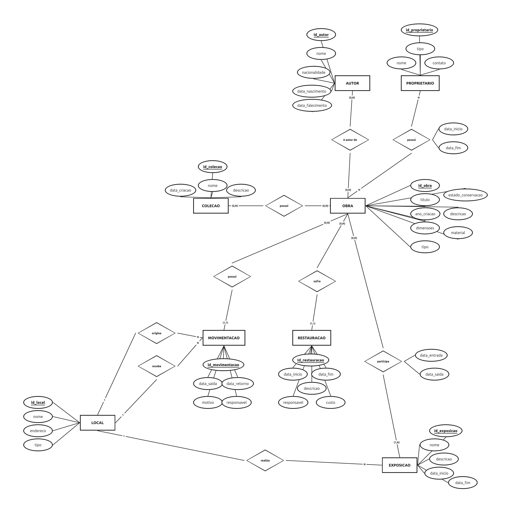

# ArqMuse

Sistema de gerenciamento de acervos e exposições de museus.

## Sobre o projeto

O **ArqMuse** é um projeto de banco de dados desenvolvido para auxiliar na gestão de acervos e exposições de museus. O sistema busca centralizar e organizar informações relacionadas às obras, autores, coleções, proprietários, exposições, restaurações e movimentações.

O projeto foi desenvolvido no contexto da disciplina de **Banco de Dados**, passando pelas etapas de modelagem conceitual e implementação do banco de dados.

## Objetivos

- Modelar a estrutura de um banco de dados para gerenciamento de acervos;
- Organizar e manter a integridade dos dados;
- Permitir o cadastro e gerenciamento de obras;
- Gerenciar autores e proprietários;
- Controlar coleções e exposições;
- Registrar restaurações realizadas nas obras;
- Acompanhar o histórico de movimentações das obras.

## Funcionalidades

- Cadastro e gerenciamento de obras/objetos;
- Cadastro e gerenciamento de autores;
- Cadastro de proprietários;
- Gerenciamento de coleções;
- Cadastro e gerenciamento de exposições;
- Registro de restaurações;
- Registro de movimentações das obras.

## Modelo Entidade-Relacionamento

O banco de dados é baseado no seguinte modelo conceitual:

> 

## Tecnologias

- **SQL** — Linguagem utilizada para criação e manipulação dos dados;
- **Visual Studio Code** — Ambiente de desenvolvimento;
- **Git e GitHub** — Controle de versão e armazenamento do projeto.
